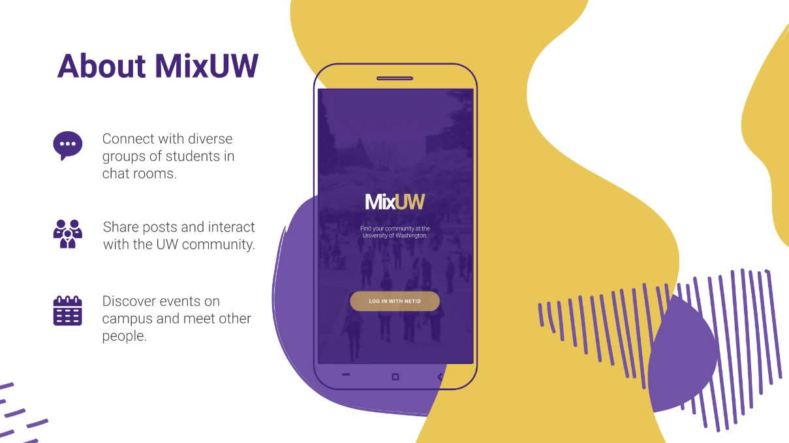

# MixUW

UI prototype for a University of Washington community app to bridge social divides.
I worked in a team of five students to perform user research and design the prototype using UI principles.

MixUW Video Presentation:
https://www.youtube.com/watch?v=VT9U5fOIehs&feature=youtu.be

Figma Prototype:
https://www.figma.com/file/atHX1XfytD4lVk79jPwqXl/MixUW-Prototype?node-id=0%3A1
